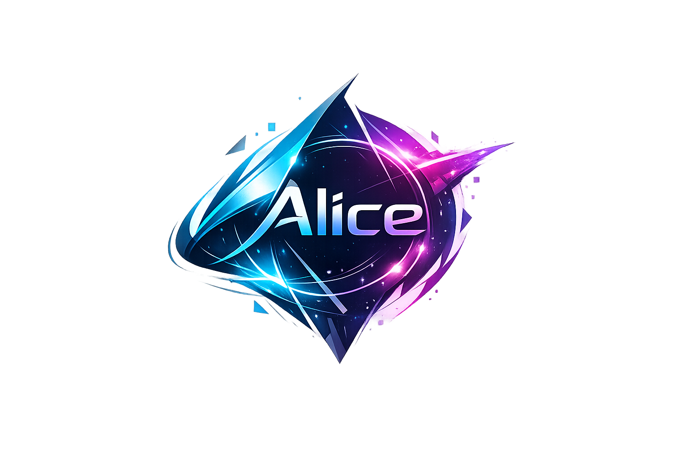

WARNING: Alice is a very early WIP project, shouldn't be used in production code for now!




Alice is an advanced general-purpose framework written in C++26, designed from the ground up to balance safety, performance, and ergonomics.


## 🌟 Vision

Alice is not just a framework — it’s a testament to what C++26 can offer when safety, performance, and developer experience are treated as first‑class citizens. The goal is to empower developers to build ambitious projects without sacrificing clarity or reliability.


## 🎯 Core Principles

- Safety → Strong compile‑time checks, explicit context management, and zero‑overhead abstractions to prevent common C++ pitfalls.
- Performance → Deterministic, cache‑friendly systems optimized for most performance-demanding applications.
- Ergonomics → Clear APIs, onboarding‑friendly documentation, and expressive patterns that make complex systems approachable.


## 🚀 Getting Started

### ⚙️ Prerequisites

- Latest Python3.
- Latest Visual Studio Code with the recommended extensions in `.vscode/extensions.json` enabled: Python, C/C++, clangd (with the path pointing to the clangd binary you want to use), and LLDB DAP (with the path pointing to the lldb-dap binary you want to use). In the case of C/C++ and clangd extensions, pick one depending on which C++ toolchain (LLVM vs GCC) you're using.
- Latest Git.
- A 64-bits architecture and system.
- A GPU able to run D3D12, Vulkan and Metal, in their respective systems.
- A C++26‑capable compiler (only Clang ≥ 22 or GCC ≥ 16).
- CMake ≥ 4.2.3.
- Latest Ninja.


### 🏗️ Setup & Building

First, make sure you installed ``code`` in the PATH environment variable. If not, do so, and use it ALWAYS to open the Alice folder.

Afterwards, make sure you have installed the recommended Visual Studio Code extensions listed in `.vscode/extensions.json`, and then define the following environment variables:

- ``ALICE_COMPILER_PATH``: with a valid path pointing to the C++ compiler binary you wish to use for compilation, e.g `/opt/homebrew/opt/llvm/bin/clang++`.
- ``ALICE_LINKER_PATH``: with a valid path pointing to the C++ linker binary you wish to use at the linking phase, e.g `/opt/homebrew/opt/lld/bin/lld`.
- Optionally ``ALICE_GDB_PATH``: if you want to debug using GDB, you need to setup this environment variable pointing to its path, e.g `/usr/bin/gdb`.

Then download the repository and enter its folder within Visual Studio Code:

```bash
git clone https://github.com/Netxonica/Alice.git
code Alice
```

If you're building for Darwin/macOS, modify the Info.plist file at the base project's directory (the level this very same file, README.md, is placed at), and fill it with whatever you want.

Finally build, debug, and/or run from within Visual Studio Code.


### 📚 Documentation

The documentation of Alice is under the Documentation folder in a Markdown format, ideal to read with the support of a Markdown renderer.


## 💬 FAQ

- Q: Why no RTTI or exceptions even on debug builds?
- A: For RTTI, i really don't like the bloat it adds, we genuinely think it's a bad feature. About exceptions on the other hand, those are decent, but generally game developers don't like how these work and (wrongly) believe these are slow. They are, but mostly in the context of the cold path in the control flow of the application (when the exception is actually thrown and caught). Either way, because of this bad fame, we will roll a bi-variant monad similar to Rust's Result or C++23's std::expected.

- Q: Why partially reinventing the wheel?
- A: Some features add little tweaks here and there that the standard library's features often don't tend to handle, so it's not only reinventing the wheel, it's about making the wheel better in many cases.

- Q: Why no third-party libraries?
- A: Control.

- Q: Where's the cross-platform support?
- A: Patience. For now we're focused at building the Darwin/macOS port.


## ⚖️ License & Usage

Alice is released under the Netxonica Non-Commercial License (NCL).

### Why this license?

We believe in the power of open collaboration and learning. We want Alice to be a resource for students, researchers, and hobbyists to tinker with without barriers. However, to keep the project sustainable and protect the intellectual property we've built, we reserve the right to commercialize the software.

In short: If you’re using Alice to learn or explore, it’s yours to play with. If you’re using Alice to make money, we need to talk first.

Note: Any distribution of the software must include the original copyright notice and the LICENSE.md file found in this repository.

### Commercial Licensing

Building something big? If you are interested in using Alice for a commercial venture, enterprise application, or would like to discuss acquiring IP rights, we are happy to chat.

📧 Get in touch: verodeving@gmail.com