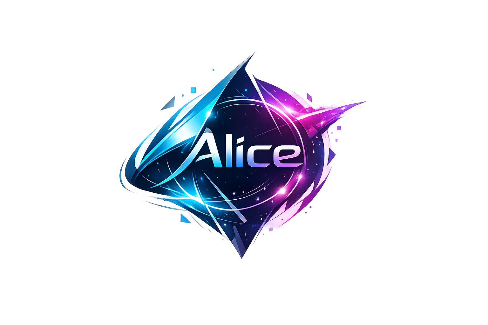

**Alice** is a modern C++26 project built around three core principles: **safety**, **performance**, and **ergonomics**. It leverages the latest language features to deliver a robust and expressive programming experience without sacrificing speed or correctness.

---

## Design Philosophy

### Safety

Alice is designed with safety as a first-class concern. Memory safety, type safety, and well-defined behavior are enforced wherever possible through language-level guarantees and careful API design. Undefined behavior is treated as a bug in Alice itself.


### Performance

Alice targets modern hardware and makes no apologies for it. By requiring up-to-date compilers, architectures, and GPU APIs, Alice can take full advantage of contemporary CPU and GPU capabilities without carrying legacy baggage.


### Ergonomics

Good software should be a pleasure to use. Alice prioritizes clean, expressive APIs, clear error messages, and a smooth developer experience from first build to production deployment.

---

## Requirements

### Compilers

Alice requires a compiler with full C++26 support:

| Compiler | Minimum Version |
|----------|-----------------|
| Clang    | 24+             |
| GCC      | 17+             |
| MSVC     | 14.52+          |


### Build System

| Tool  | Minimum Version |
|-------|-----------------|
| CMake | 4.3.3+          |
| Ninja | 1.13+           |


### Architectures

| Architecture |
|--------------|
| x86\_64      |
| ARM64        |


### Operating Systems

| OS      | Minimum version |
|---------|-----------------|
| Linux   | 7.0+            |
| macOS   | 26.5+           |
| Windows | 11 26H1+        |


### SDK

| SDK     | Minimum SDK                                                                           |
|---------|---------------------------------------------------------------------------------------|
| Linux   | Wayland 1.25+ (with the scanner and protocol), latest EGL & GBM, and latest PkgConfig |
| macOS   | Xcode 26.5+                                                                           |
| Windows | Latest Visual Studio 2026 and Windows SDK 10.0.28000+                                 |


### GPU

Alice requires a GPU and drivers capable of running the latest graphics APIs for the target platform:

| Platform | Required API                           |
|----------|----------------------------------------|
| macOS    | Metal 4+                               |
| Linux    | Vulkan SDK 1.4.350+                    |
| Windows  | DXC 1.9.2602+ and D3D12 Agility 1.619+ |

---

## Getting Started

### Clone

```bash
git clone https://github.com/Netxonica/Alice.git
cd Alice
```


### Build

In the case of macOS, modify Info.plist as you prefer.

```bash
cmake -B Build/{Debug|Release} -S . -G Ninja -D CMAKE_BUILD_TYPE={Debug|Release}
ninja clean_app -C Build/{Debug|Release}
ninja -C Build/{Debug|Release}
```


### Visual Studio Code integration (optional)

- Install Python 3 to use the release task (optional).
- Install the recommended extensions in `.vscode/extensions.json`.
- Define the following environment variables within PATH:
    - `ALICE_GDB_PATH`: The path to the GDB binary (optional, only required when debugging with GDB.)
    - `ALICE_LINKER_PATH`: The path to the linker binary.
    - `ALICE_COMPILER_PATH`: The path to the C++ compiler.
- Use the 'Run and Debug' view to compile and debug.

---

## Documentation

The header files under the `Source` folder are all documented with java-doc style comments. Perfect to generate your own Doxygen documentation.

If something is not documented, it's not meant to be used.

---

## Testing

Every documented feature is tested thoroughly under the `Test` folder. These also showcase how the features are meant to be used.

---

## License

See [LICENSE](LICENSE.md) for details.

---

## Notice

See [NOTICE](NOTICE.md) for details.